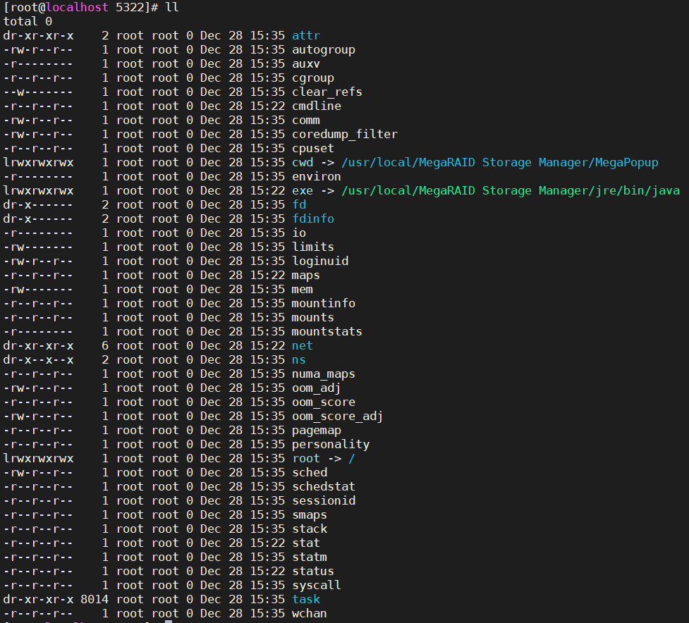

# 登录相关

## ssh无法登陆

1. 问题描述

    终端提示：`-bash: fork: Cannot allocate memory`，而后并不进入ssh终端，而是进入`-bash-4.1#`终端中，执行任何命令都提示`-bash: fork: Cannot allocate memory`。

2. 问题排查

    # 报错搜索

    针对`-bash: fork: Cannot allocate memory`报错，进行检索，在得到的[StackOverflow回答](https://stackoverflow.com/questions/43652021/bash-fork-cannot-allocate-memory)中定位到相应原因。

    # 原因分析

    Centos对进程数有上限限制（32768），亦即最多同时运行32768个进程，但是检查各个软件对应进程数后（检查代码：`ps -eo nlwp,pid,args --sort nlwp`）发现，存在单个程序占用了31948个进程的情况，亦即如下进程，根据PID将其结束掉之后，问题解决。
    `31948 5286 ../jre/bin/java -classpath .:Popup.jar:../GUI.jar Popup.Communicator ajsgyqkj=71244`

    查询该程序相关信息（`.:Popup.jar:../GUI.jar Popup.Communicator ajsgyqkj=71244`）后发现，该程序为MegaRaid的信息推送程序（经检查，其位于`/usr/local/MegaRAID Storage Manager`文件夹中），猜测可能是21号凌晨断电重启后，raid阵列出现了很多推送信息，但由于不处在图形化界面下，无法显示，因而进程数逐渐累加到达上限后，无法创建新的进程，导致ssh无法连接。

    终止该推送程序后，目前未发现该程序重启的情况，现已在图形化界面中将相应不必要的Raid管理程序卸载（后经重启确认，发现**卸载失败**，佛了），避免未来再发生类似的情况。

3. 后续情况

    # 2020.12.28 问题再次出现，重启后对应任务的进程数仍快速增加，检查pid对应任务信息如下
    

    # 解决方案

    1. 根据pid直接终止相应任务

    2. 修改该任务执行文件夹`/usr/local/MegaRAID Storage Manager`的文件名为`/usr/local/MegaRAID_Storage_Manager_bak`避免再次自启动

    # 进一步排查

    1. 开机无法进入图形化管理界面原因（报错提示）

        * Starting ctdbd service \[FAILED\]

            问题未找到相应解决方案，ctdbd参考安装链接为[CentOS7下源码安装CTDB并尝试使用](https://blog.csdn.net/dandanfengyun/article/details/104971908)

        * :cbl runuser: user cbl does not exist

            问题可能在于VNC的配置信息上，将不应该再出现的`cbl`用户纳入进来，等待超哥解决- -
